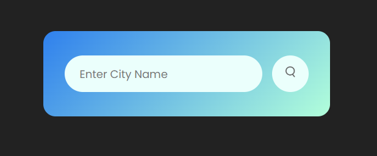
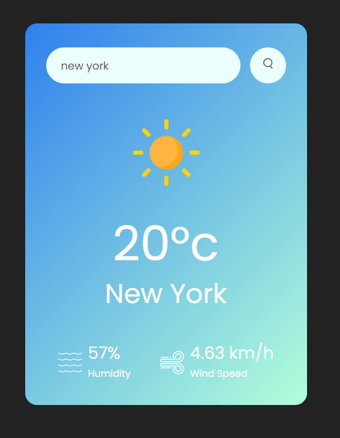

# WeatherApp README

Welcome to the weather-app repository! This is a web application that allows users to check the current weather conditions in different locations. The app is built using HTML, CSS, and JavaScript to provide an interactive and visually appealing experience. 

## Table of Contents
- [Introduction](#introduction)
- [Features](#features)
- [Installation](#installation)
- [Usage](#usage)
- [Technologies Used](#technologies-used)
- [Screenshots](#screenshots)
- [Contributing](#contributing)
- [License](#license)

## Introduction
WeatherApp is a project developed by Thembi as part of upskilling in web development. The app fetches real-time weather data from a weather API and presents it in a user-friendly manner on the web interface.

## Features
- **Current Weather:** Get the latest weather information for a specific location.
- **Search Functionality:** Enter the name of the city to retrieve weather data.

## Installation
To run the WeatherApp locally, follow these steps:

1. Clone this repository:
   ```
   git clone https://github.com/ngww/weather-app.git
   ```

2. Navigate to the project directory:
   ```
   cd weather-app
   ```

3. Open the `index.html` file in your preferred web browser.

## Usage
1. Open the app in your browser.
2. Enter the name of the city in the search bar.
3. Press the "Search" button to retrieve the current weather information.
4. Toggle the temperature unit as needed.

## Technologies Used
- HTML5
- CSS3
- JavaScript
- [Weather API](https://openweathermap.org/api) - Used to fetch weather data

## Screenshots
[Live Demo](https://weather-app-ngww.vercel.app)




## Contributing
Contributions are welcome! If you find any issues or want to enhance the app, feel free to create a pull request. Please ensure that your changes align with the project's goals.

## License
This project is licensed under the [MIT License](LICENSE).

---

Thank you for checking out WeatherApp! If you have any questions or suggestions, feel free to contact me via twitter at @ngwcodes. Enjoy exploring current weather conditions with this app!
